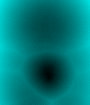
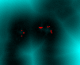

# Level-Sets
Project for "Computational Geometry &amp; 3D Modeling Applications" class

## Tasks
1. Estimate the differential coordinates of the mesh
2. Perform "Taubin smoothing" and "Taubin inflation"
3. Generate the signed distance field (SDF) of the mesh surface
4. Generate the vector force/normal field (VFF)
5. Perform collision detection and estimate the direction and magnitude of the collision response force
6. Neural approach to extract the SDF using the [SIREN](https://github.com/vsitzmann/siren) and perform collision detection using that SDF

## Results 
The SDFs plotted with the help of Matlab  

### Depedanceis
VVR_Framework
